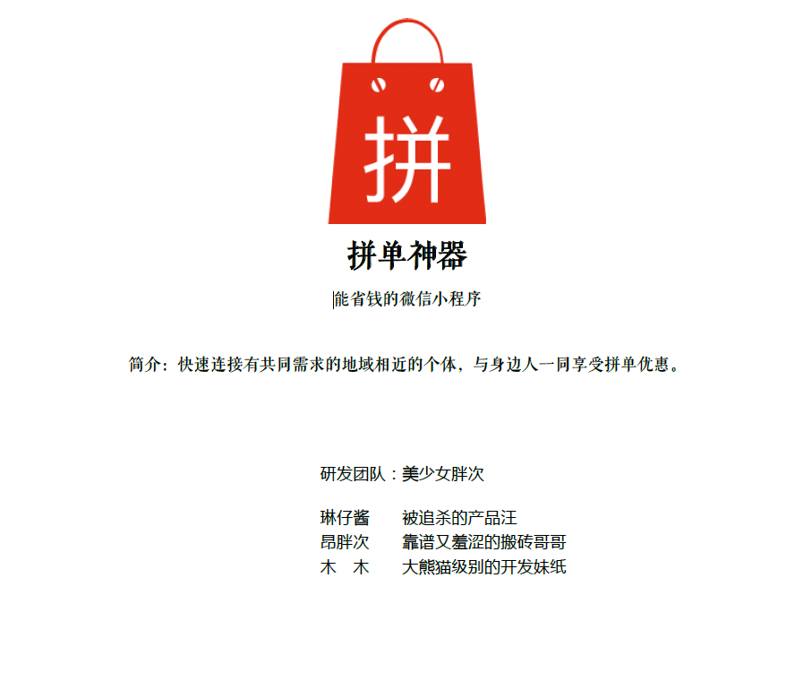

## 微信小程序-拼单神器

### 背景
&emsp;快速连接有共同需求的地域相近的个体，共享商家的一些促销活动（如：满额减、满额起送等），改善高校同学的拼单体验，与身边人一同享受拼单优惠。
### 项目框架
&emsp;前端选择是微信小程序，后端是[leanCloud](https://leancloud.cn/)。
### 功能点及完成情况概述
| 功能点 | 重要程度 | 描述 | 完成情况 |
| --- | --- | --- |---|
| 浏览拼单feed流 |     | 首页下滑浏览拼单feed流；<br/>下拉加载更多信息 | 基本完成；<br/>补充：下拉刷新暂未做，暂时未开发API； |
| 查看拼单详情 |     | 拼单feed流点击进去可查看拼单详情； | 基本完成； |
| 发起拼单（用户侧） |     | 用户发起拼单的入口：<br/>①首页红色“＋”号；<br/>②优惠信息界面，查看优惠信息时，发起拼单； | 完成；<br/>补充：由②入口进入时，自动填充相关拼单信息； |
| “立即加入”拼单 |     | 点击“立即加入”按钮，弹出该拼单的群聊二维码，长按识别二维码加群； | 完成；<br/>补充：暂时不可识别二维码<br/>原因：微信小程序图片是使用background-image，和H5 image标签不同，不支持点击事件，也不能触发微信中的长按识别二维码 |
| 校园身份验证 |     | 由于凑单的后期涉及付款、收货等行为，需要在高素质高信用群体才能更容易建立起彼此的信任关系，最终完成凑单环节，故需要进行师生身份验证环节。规定：只有进行过身份验证的用户具有发布拼单、立即加入拼单的权限。 | 在“我的”界面中展示效果完成；<br/>补充：由于缺乏用户系统暂时未关联权限逻辑。 |
| 拼单圈子选择 |     | 基于地理位置完成拼单流程，需首先定位； | 调用地图API，暂未做后续步骤； |
| 发起优惠信息（平台侧） |     | 平台侧筛选优质可拼单活动供用户选择；<br/>未来该板块可以设计更多的商业合作； | 展示效果完成，暂时未做后台发布系统； |
| 我的界面 |   | 个人基本信息及行为查看、软件相关设置等 | 完成身份验证效果展示；<br/>其他灰色部分暂时未做； |
| 删除自己已发起的拼单 |    | 拼单具有时效性，支持用户设置拼单自动过期时间或手动删除拼单； | 暂时未做； |
| 评论 |   | 便于互动交流； | 完成 |
| 分享 |   | 一键分享拼单给好友/到朋友圈，呼朋唤友一起拼单； | 暂时未做；<br/>补充：暂时未开放API |
| 点赞 |  | 为平台筛选优质拼单的一个维度 | 展示效果完成，后续步骤暂时未做； |
| 用户系统 |     | 存储用户信息及相关行为，关联用户身份认证结果； | 暂时未做；<br/>补充：未注册账号无权限； |
### 踩到的坑
1. 调用`wx.chooseImage(OBJECT)`获取本地图片地址，直接更新data,刷新页面，页面中的图片显示空白。
&emsp;&emsp;解决方案：选择图片之后先上传leanCloud，返回云地址，在写入data即可。
2. image标签没有事件绑定（暂时不知道怎么去做图片点击放大功能，有文章分享称微信小程序image是基于background-image做的，摊手┑(￣Д ￣)┍）。
&emsp;&emsp;开始想要用`scroll-view`做，不过和预想的效果完全不一样，无奈。
3. bind/catch的区别（bind事件绑定不会阻止冒泡事件向上冒泡，catch事件绑定可以阻止冒泡事件向上冒泡。）。
4. 页面data的获取：`this.data`即可，注意（this对象的指向）。
5. wx.redirectTo(OBJECT) bug 返回首页tabBar不显示,发布凑单信息之后的使用wx.navigateTo(OBJECT)，非常容易导致页面嵌套超过五个，解决方案是使用wx.navigateBack(OBJECT)，然后使用页面onShow响应去刷新页面。
6. 包裹层铺满屏幕的做法：
    - 通用css中加上 其中page类似浏览器中的body或者html    
        ```
        page {
            width: 100%;
            ming-height: 100%;
        }
        .container {
            width: 100%;
            min-height: 100%;
        }
        ```
    - 通用css中只对container类进行处理    
        ```
            .container {
                position: absolute;
                width: 100%;
                min-height: 100%;
            }
        ```
7. 调试时，切换机型，首页浮动“＋”入口位置下移。

### how to run
需要申请一个leancloud账号以及应用，找到应用中的设置中的应用key，更改app.js中的对应的appid和appkey，如下：
```
AV.init({ 
      appId: '你自己的appId或者测试用例', 
      appKey: '你自己的appKey或者测试用例', 
      });
```
    测试用例中appId: 'DshsfhQRaevm0oRTrm36Ix3u-gzGzoHsz',appKey: 'MFkExxSQFTK6q6G5LlwSIYXf'